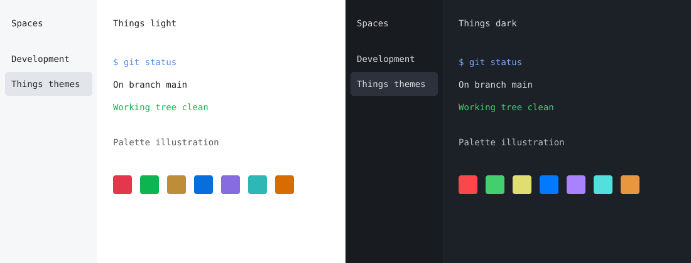

# Things for Herdr

A light and dark Herdr adaptation of [Obsidian Things](https://github.com/colineckert/obsidian-things), created by Colin Eckert. The palette comes from installed Things 2.2.4, with white or slate panels, quiet sidebar backgrounds, blue accents, and the original semantic colors.



## Install

Requires Python 3.11 or newer and a Herdr version with `theme.custom.light` and `theme.custom.dark`. Verified with Herdr 0.9.3. From this repository:

```sh
python3 install.py
```

The installer replaces the theme tables in `~/.config/herdr/config.toml` and preserves other configuration values and comments. It saves a timestamped backup before each change. `HERDR_CONFIG_PATH` is respected; `--config /path/to/config.toml` overrides the destination. Unsupported inline or dotted theme definitions cause a safe refusal before the file changes.

Inside a Herdr pane, apply the new palette without restarting the server:

```sh
herdr server reload-config
```

Or use `python3 install.py --reload` for both steps. The command requires `HERDR_ENV=1` and never stops or restarts the session.

## Appearance

`theme.toml` overrides all 19 documented Herdr color tokens for both appearances. `auto_switch = true` follows the host terminal's light or dark appearance. Pair it with the Things Ghostty theme using Ghostty's light/dark theme selector. The fallback appearance is light, matching the macOS appearance when this adaptation was created.

The panel, sidebar, neutral surfaces, text, and semantic colors map to Things CSS base and color variables. The accent comes from Things HSL values: `215, 75%, 60%` in light mode and `215, 75%, 70%` for dark text accents. The navigate selection uses the interactive blue `215, 75%, 60%` at 25% over each editor background, matching the shared terminal selections. Herdr uses this composite for its sidebar navigation rows. Neutral active rows use Things hover and dark base-25 colors.

Herdr draws its own interface; applications in panes keep their own styles and explicit ANSI colors. Terminal fonts, syntax highlighting, rounded controls, Obsidian's typography, and spacing cannot be supplied by a Herdr color theme. The SVG illustrates the palette and is not an application screenshot.

## Rollback

Copy the timestamped backup printed by the installer over the configuration, then reload inside Herdr:

```sh
cp "$HOME/.config/herdr/config.toml.things-backup-YYYYMMDD-HHMMSS-microseconds" "$HOME/.config/herdr/config.toml"
herdr server reload-config
```

## Sources and license

- [Things source](https://github.com/colineckert/obsidian-things), version 2.2.4. `NOTICE` records the installed source file's SHA-256.
- [Herdr configuration reference](https://herdr.dev/docs/config-reference/) and installed `herdr --default-config` define the supported settings.
- [Upstream MIT license](https://github.com/colineckert/obsidian-things/blob/main/LICENSE). `LICENSE` preserves its existing Stephan Ango notice. Colin Eckert is credited here and in `NOTICE` as Things' creator.

This repository is an independent adaptation.
